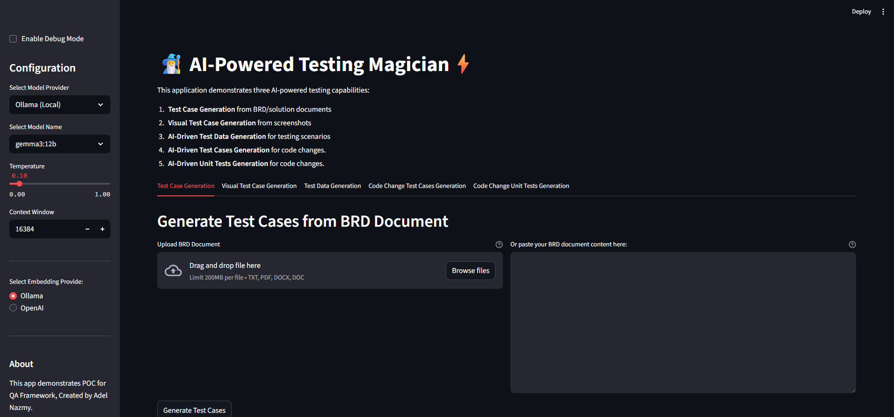

# 🧙‍♂️ AI-Powered Testing Magician ⚡

  <!-- Replace with a screenshot URL -->

This application demonstrates five powerful AI-powered testing capabilities, aiming to streamline and accelerate the testing process.

## Description

This project utilizes the latest advancements in AI to automate key aspects of software testing.  It's a proof-of-concept (POC) for integrating AI into the testing workflow, focusing on reducing manual effort and improving test coverage. The application is built using Streamlit for the user interface and leverages LlamaIndex and various LLMs for AI-powered features.

## Technologies Used

*   **Python:** The primary programming language.
*   **Streamlit:**  For building the interactive user interface.
*   **LlamaIndex:** A framework for connecting LLMs to external data sources and building AI-powered applications.
*   **Ollama:**  An open-source LLM (Large Language Model) runner used for generating text and code.
*   **OpenAI:**  Alternative LLM provider (for comparison and potential integration).
*   **Selenium:**  Used for browser automation and capturing screenshots (for visual test case generation).
*   **PIL (Pillow):**  Python Imaging Library for image manipulation.
*   **GitPython:** For version control and potentially integrating with Git repositories.

## Features

*   **Test Case Generation:** Automatically generates test cases from Business Requirements Documents (BRD) or solution documents.
*   **Visual Test Case Generation:** Creates test cases directly from screenshots, allowing for visual regression testing and validation. (Utilizes Selenium and PIL)
*   **AI-Driven Test Data Generation:** Provides realistic and comprehensive test data for a variety of testing scenarios.
*   **AI-Driven Test Case Generation for Code Changes:**  Analyzes code changes and generates associated test cases to ensure stability and correctness.
*   **AI-Driven Unit Test Generation for Code Changes:**  Creates unit tests from code changes, aiding in automated testing and code quality.

## How to Use

**Note:** This is a proof-of-concept, and usage might require setup and configuration.

1.  **Installation:**
    *   Clone the repository: `git clone [repository_url]`
    *   Create a Python virtual environment (recommended): `python3 -m venv .venv`
    *   Activate the virtual environment: `source .venv/bin/activate` (Linux/macOS) or `.venv\Scripts\activate` (Windows)
    *   Install the required packages: `pip install -r requirements.txt` (you'll need a `requirements.txt` file with the dependencies listed)

2.  **Configuration:**
    *   **LLM Provider:** Select between Ollama and OpenAI.  You may need to have Ollama installed and running locally or provide an OpenAI API key.
    *   **Ollama Setup (if using):** Ensure Ollama is installed and the desired model is pulled.
    *   **OpenAI API Key (if using):**  Set the `OPENAI_API_KEY` environment variable.

3.  **Usage:**
    *   Launch the Streamlit application: `streamlit run app.py` (assuming your main application file is named `app.py`)
    *   **Upload Documents/Screenshots:**  Drag and drop your BRD, solution documents, or screenshots into the designated area.
    *   **Select AI Provider:** Choose between available AI providers (e.g., "AI Provider A" - currently labeled "AI" in the image).
    *   **Configure Settings:** Adjust parameters like the number of test cases to generate or specific visual elements to focus on during screenshot analysis.
    *   **Generate Test Cases:** Click the "Generate Test Cases" button to initiate the AI-powered test generation process.
    *   **Review and Refine:**  Examine the generated test cases and refine them as needed to ensure accuracy and completeness.

## Contributing

We welcome contributions to this project!  Here's a basic guide to get started:

1.  **Fork the Repository:** Create a copy of the repository to your own GitHub account.
2.  **Create a Branch:**  Create a new branch for your changes (e.g., `feature/new-documentation`).
3.  **Make Changes:** Implement your changes, adhering to the project's coding style and guidelines.
4.  **Commit Changes:**  Commit your changes with descriptive commit messages.
5.  **Push Changes:** Push your branch to your forked repository.
6.  **Create a Pull Request:**  Create a pull request to merge your changes into the main branch.

We encourage contributions that:

*   Improve the accuracy and efficiency of the AI models.
*   Expand the supported document formats and testing scenarios.
*   Enhance the user interface and overall usability of the application.